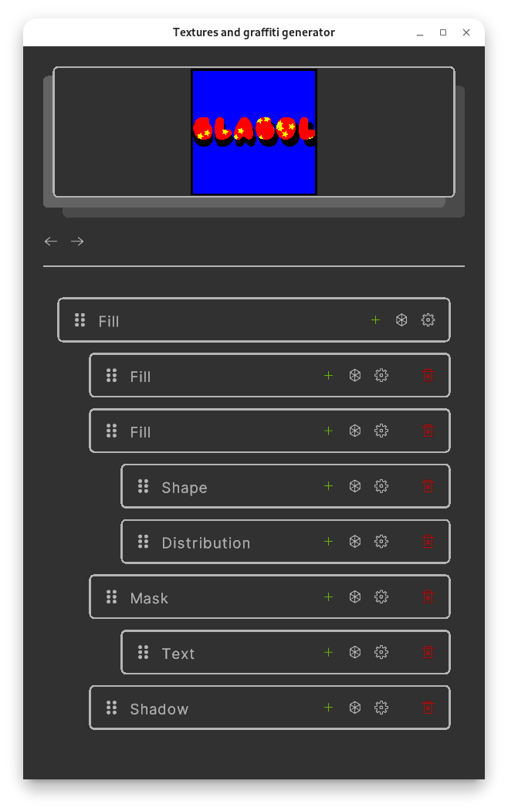
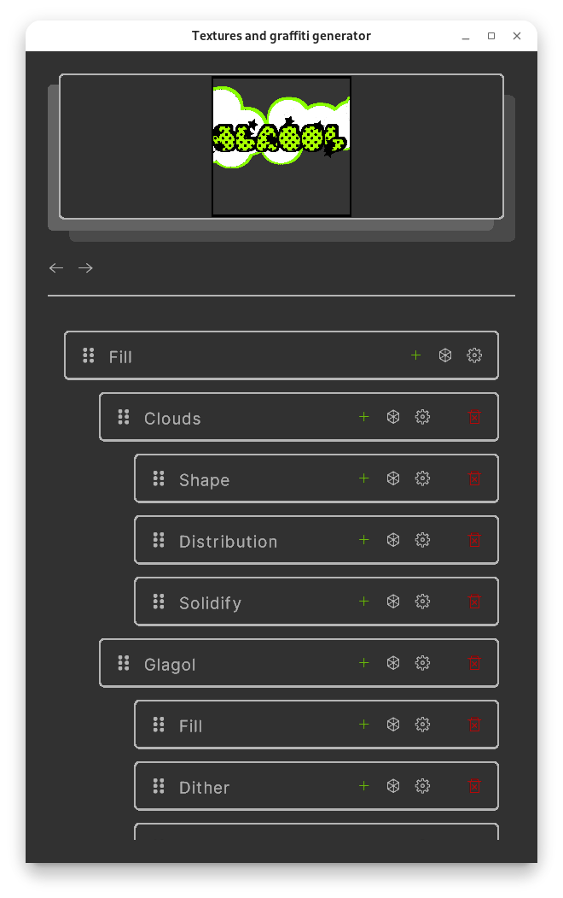
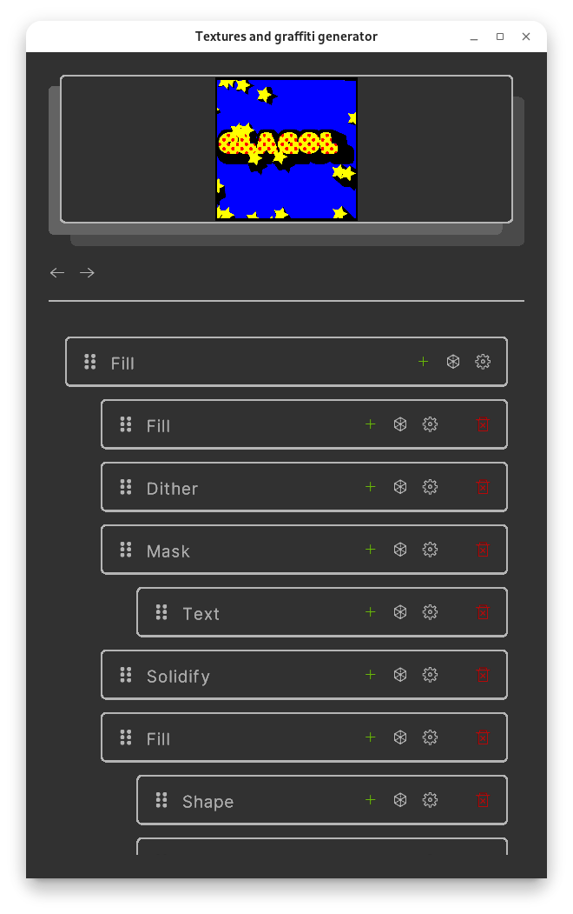

# Description

Tagg is a textures and graffiti generator. Create stacks of layers at once and apply them to text or group of textures based on the material id or other parameters to speed up your workflow

Tagg is in early development stage so it lacks of features and have lots of bugs

There is no iterface for save or load files, you can press `CTRL+S`​ to save the project and result. To load project rename project file to `save.tagg`​ located in projects folder nearby the executable and restart the app

## Links

[My Discord](https://discord.gg/duDwM6PjGk)

[Github Repository](https://github.com/Teslotik/tagg)

‍
## Demo

